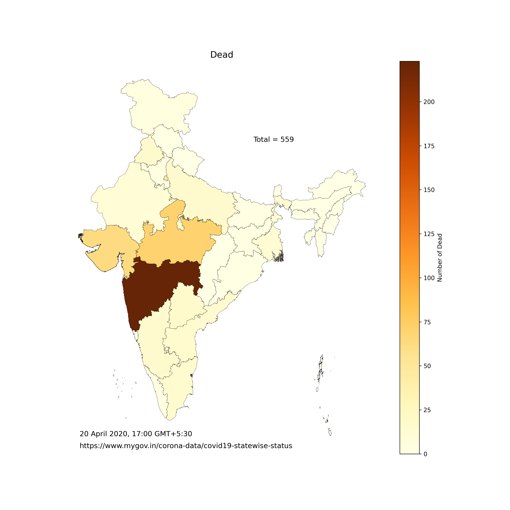

# COVID-19 India Map and Bar Plot Race    


### The codes here are to generate maps and bar plots of COVID-19 case distribution in terms of number of Active, Cured and Dead cases. 

The repository contains 2 plain python codes, ```covid19Map.py```, ```covid19Animation.py``` and one jupyter notebook, ```covid19_barPlotRace.ipynb```. The first code produces the maps, the second combines these into a gif animation, while the code in the notebook produces the bar plot race shown above. The data used is available at the following webpage: 
https://www.mygov.in/corona-data/covid19-statewise-status and has been extracted from it. 

Whenever the code is run, the latest data is extracted from the static webpage. Chrome is used for opening the webpage before the data can be extracted. A separate webdriver is required for this which can be downloaded from (https://chromedriver.chromium.org/). The concaneted data is saved in ```covid19_concatenatedData.csv```

__Selenium__, __BeautifulSoup__ and __Geopandas__ are used to create the maps. __imagemagick__ writer in jupyter notebook with __jshtml__ plugin helps in the generation of the bar plot race. This dynamic bar plot illustrates Top 5 adversely affected Indian States between a period of April 6th to June 5th, 2020. 

The map showing the count of Dead from last run of the code is given below. 


<!--- Another program can be written which will automate the running of this code, so that the variation of the geographic distribution can be monitored continously. Other types of overlayes can also done on the geographic maps, for instance, bubble maps. They can be made interactive using packages like plotly. The awesome interactive map on the [WHO dashboard](https://who.sprinklr.com/) is one such tool. <!--- which uses their own proprietry programs to generate the plots. -->

[comment]: # (This is a comment)
